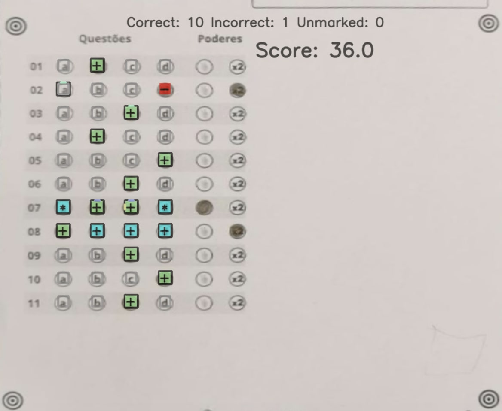

# OMR Checker

Read OMR sheets fast and accurately using a scanner 🖨 or your phone 🤳.

## What is OMR?

OMR stands for Optical Mark Recognition, used to detect and interpret human-marked data on documents. OMR refers to the process of reading and evaluating OMR sheets, commonly used in exams, surveys, and other forms.

#### **Quick Links**

- [Installation](#getting-started)
- [User Guide](https://github.com/Udayraj123/OMRChecker/wiki)
- [Contributor Guide](https://github.com/Udayraj123/OMRChecker/blob/master/CONTRIBUTING.md)
- [Project Ideas List](https://github.com/users/Udayraj123/projects/2/views/1)

<hr />

[](https://github.com/Udayraj123/OMRChecker/pull/new/master) <!-- [](https://github.com/Udayraj123/OMRChecker/wiki/TODOs) -->
[](https://github.com/Udayraj123/OMRChecker/pulls?q=is%3Aclosed)
[](https://GitHub.com/Udayraj123/OMRChecker/issues?q=is%3Aissue+is%3Aclosed)
[](https://github.com/Udayraj123/OMRChecker/issues/5)

<!-- [](https://GitHub.com/Udayraj123/OMRChecker/graphs/contributors/) -->

[](https://GitHub.com/Udayraj123/OMRChecker/stargazers/)
[](https://hits.seeyoufarm.com)
[](https://discord.gg/qFv2Vqf)

<!-- [](https://colab.research.google.com/gist/Udayraj123/a125b1531c61cceed5f06994329cba66/omrchecker-on-cloud.ipynb) -->

## 🎯 Features

A full-fledged OMR checking software that can read and evaluate OMR sheets scanned at any angle and having any color.

| Specs  |    |
| :--------------------- | :--------------------------------------------------------------------------------------------------------------------------------------------------------------------------------------------------------------- |
| 💯 **Accurate**        | Currently nearly 100% accurate on good quality document scans; and about 90% accurate on mobile images.                                                                                                          |
| 💪🏿 **Robust**          | Supports low resolution, xeroxed sheets. See [**Robustness**](https://github.com/Udayraj123/OMRChecker/wiki/Robustness) for more.                                                                                |
| ⏩ **Fast**            | Current processing speed without any optimization is 200 OMRs/minute.                                                                                                                                            |
| ✅ **Customizable**    | [Easily apply](https://github.com/Udayraj123/OMRChecker/wiki/User-Guide) to custom OMR layouts, surveys, etc.                                                                                                    |
| 📊 **Visually Rich**   | [Get insights](https://github.com/Udayraj123/OMRChecker/wiki/Rich-Visuals) to configure and debug easily.                                                                                                        |
| 🎈 **Lightweight**     | Very minimal core code size.                                                                                                                                                                                     |
| 🏫 **Large Scale**     | Tested on a large scale at [Technothlon](https://en.wikipedia.org/wiki/Technothlon).                                                                                                                             |
| 👩🏿‍💻 **Dev Friendly**    | [Pylinted](http://pylint.pycqa.org/) and [Black formatted](https://github.com/psf/black) code. Also has a [developer community](https://discord.gg/qFv2Vqf) on discord.                                          |

Note: For solving interesting challenges, developers can check out [**TODOs**](https://github.com/Udayraj123/OMRChecker/wiki/TODOs).

See the complete guide and details at [Project Wiki](https://github.com/Udayraj123/OMRChecker/wiki/).

<!-- 💁🏿‍♂️ **User Friendly** - WIP, Help by contributing! -->

## 💡 What can OMRChecker do for me?

Once you configure the OMR layout, just throw images of the sheets at the software; and you'll get back the marked responses in an excel sheet!

Images can be taken from various angles as shown below-

<p align="center">
	
</p>

### Code in action on images taken by scanner:

<p align="center">
	

</p>

### Code in action on images taken by a mobile phone:

<p align="center">
	
</p>

## Visuals

### Processing steps

See step-by-step processing of any OMR sheet:

<p align="center">
	<a href="https://github.com/Udayraj123/OMRChecker/wiki/Rich-Visuals">
		
	</a>
	<br>
	*Note: This image is generated by the code itself!*
</p>

### Output

Get a CSV sheet containing the detected responses and evaluated scores:

<p align="center">
	<a href="https://github.com/Udayraj123/OMRChecker/wiki/Rich-Visuals">
		
	</a>
</p>

We now support [colored outputs](https://github.com/Udayraj123/OMRChecker/wiki/%5Bv2%5D-About-Evaluation) as well. Here's a sample output on another image -
<p align="center">
	<a href="https://github.com/Udayraj123/OMRChecker/wiki/%5Bv2%5D-About-Evaluation">
		
	</a>
</p>

#### There are many more visuals in the wiki. Check them out [here!](https://github.com/Udayraj123/OMRChecker/wiki/Rich-Visuals)

## Getting started


**Operating system:** OSX or Linux is recommended although Windows is also supported.

### 1. Install global dependencies

 

To check if python3 and pip is already installed:

```bash
python3 --version
python3 -m pip --version
```

<details>
	<summary><b>Install Python3</b></summary>

To install python3 follow instructions [here](https://www.python.org/downloads/)

To install pip - follow instructions [here](https://pip.pypa.io/en/stable/installation/)

</details>
<details>
<summary><b>Install OpenCV</b></summary>

**Any installation method is fine.**

Recommended:

```bash
python3 -m pip install --user --upgrade pip
python3 -m pip install --user opencv-python
python3 -m pip install --user opencv-contrib-python
```

More details on pip install openCV [here](https://www.pyimagesearch.com/2018/09/19/pip-install-opencv/).

</details>

<details>

<summary><b>Extra steps(for Linux users only)</b></summary>

<b>Installing missing libraries(if any):</b>

On a fresh computer, some of the libraries may get missing in event after a successful pip install. Install them using following commands[(ref)](https://www.pyimagesearch.com/2018/05/28/ubuntu-18-04-how-to-install-opencv/):

```bash
sudo apt-get install -y build-essential cmake unzip pkg-config
sudo apt-get install -y libjpeg-dev libpng-dev libtiff-dev
sudo apt-get install -y libavcodec-dev libavformat-dev libswscale-dev libv4l-dev
sudo apt-get install -y libatlas-base-dev gfortran
```

</details>

### 2. Install project dependencies

Clone the repo

```bash
git clone https://github.com/Udayraj123/OMRChecker
cd OMRChecker/
```

Install pip requirements

```bash
python3 -m pip install --user -r requirements.txt
```

_**Note:** If you face a distutils error in pip, use `--ignore-installed` flag in above command._

<!-- Wiki should not get cloned -->

### 3. Run the code

1. First copy and examine the sample data to know how to structure your inputs:
   ```bash
   cp -r ./samples/sample1 inputs/
   # Note: you may remove previous inputs (if any) with `mv inputs/* ~/.trash`
   # Change the number N in sampleN to see more examples
   ```
2. Run OMRChecker:
   ```bash
   python3 main.py
   ```

Alternatively you can also use `python3 main.py -i ./samples/sample1`.

Each example in the samples folder demonstrates different ways in which OMRChecker can be used.

### Common Issues

<details>
<summary>
	1. [Windows] ERROR: Could not open requirements file<br>
	</summary>
Command: <code>python3 -m pip install --user -r requirements.txt</code>
<br>
	Link to Solution:  <a href="https://github.com/Udayraj123/OMRChecker/issues/54#issuecomment-1264569006">#54</a>
</details>
<details>
<summary>
2. [Linux] ERROR: No module named pip<br>
</summary>
Command: <code>python3 -m pip install --user --upgrade pip</code>
<br>
	Link to Solution: <a href="https://github.com/Udayraj123/OMRChecker/issues/70#issuecomment-1268094136">#70</a>
</details>

## OMRChecker for custom OMR Sheets

1. First, [create your own template.json](https://github.com/Udayraj123/OMRChecker/wiki/User-Guide).
2. Configure the tuning parameters.
3. Run OMRChecker with appropriate arguments (See full usage).
<!-- 4. Add answer key( TODO: add answer key/marking scheme guide)  -->

## Full Usage

```
python3 main.py [--setLayout] [--inputDir dir1] [--outputDir dir1]
```

Explanation for the arguments:

`--setLayout`: Set up OMR template layout - modify your json file and run again until the template is set.

`--inputDir`: Specify an input directory.

`--outputDir`: Specify an output directory.

<details>
<summary>
 <b>Deprecation logs</b>
</summary>

- The old `--noCropping` flag has been replaced with the 'CropPage' plugin in "preProcessors" of the template.json(see [samples](https://github.com/Udayraj123/OMRChecker/tree/master/samples)).
- The `--autoAlign` flag is deprecated due to low performance on a generic OMR sheet
- The `--template` flag is deprecated and instead it's recommended to keep the template file at the parent folder containing folders of different images
</details>

<!-- #### Testing the code
Datasets to test on :
Low Quality Dataset(For CV Based methods)) (1.5 GB)
Standard Quality Dataset(For ML Based methods) (3 GB)
High Quality Dataset(For custom processing) (6 GB)
-->

## FAQ

<details>
<summary>
<b>Why is this software free?</b>
</summary>

This project was born out of a student-led organization called as [Technothlon](https://technothlon.techniche.org.in). It is a logic-based international school championship organized by students of IIT Guwahati. Being a non-profit organization, and after seeing it work fabulously at such a large scale we decided to share this tool with the world. The OMR checking processes still involves so much tediousness which we aim to reduce dramatically.

We believe in the power of open source! Currently, OMRChecker is in an intermediate stage where only developers can use it. We hope to see it become more user-friendly as well as robust from exposure to different inputs from you all!

[](https://github.com/ellerbrock/open-source-badges/)

</details>

<details>
<summary>
<b>Can I use this code in my (public) work?</b>
</summary>

OMRChecker can be forked and modified. You are encouraged to play with it and we would love to see your own projects in action!

It is published under the [MIT license](https://github.com/Udayraj123/OMRChecker/blob/master/LICENSE).

</details>

<details>
<summary>
<b>What are the ways to contribute?</b>
</summary>

<!-- - Help OMRChecker reach more people by giving a star! The Goal is to reach top position for the [OMR Topic](https://github.com/topics/omr) -->

- Join the developer community on [Discord](https://discord.gg/qFv2Vqf) to fix [issues](https://github.com/Udayraj123/OMRChecker/issues) with OMRChecker.

- If this project saved you large costs on OMR Software licenses, or saved efforts to make one. Consider donating an amount of your choice(donate section).

<!--  -->
<!-- [](https://www.paypal.com/cgi-bin/webscr?cmd=_s-xclick&hosted_button_id=Z5BNNK7AVFVH8&source=url) -->
<!-- https://www.amazon.in/hz/wishlist/ls/3V0TDQBI3T8IL -->

</details>

## Credits

_A Huge thanks to:_
_**Adrian Rosebrock** for his exemplary blog:_ https://pyimagesearch.com

_**Harrison Kinsley** aka sentdex for his [video tutorials](https://www.youtube.com/watch?v=Z78zbnLlPUA&list=PLQVvvaa0QuDdttJXlLtAJxJetJcqmqlQq) and many other resources._

_**Satya Mallic** for his resourceful blog:_ https://www.learnopencv.com

_And to other amazing people from all over the globe who've made significant improvements in this project._

_Thank you!_

<!--
OpencV
matplotlib
some SO answers from roughworks
prof
-->

## Related Projects

Here's a snapshot of the [Android OMR Helper App (archived)](https://github.com/Udayraj123/AndroidOMRHelper):

<p align="center">
	<a href="https://github.com/Udayraj123/AndroidOMRHelper">
		
	</a>
</p>

## Stargazers over time

[](https://starchart.cc/Udayraj123/OMRChecker)

---

<h2 align="center">Made with ❤️ by Awesome Contributors</h2>

<a href="https://github.com/Udayraj123/OMRChecker/graphs/contributors">
  
</a>

---

### License

[](https://github.com/Udayraj123/OMRChecker/blob/master/LICENSE)

For more details see [LICENSE](https://github.com/Udayraj123/OMRChecker/blob/master/LICENSE).

### Donate

<a href="https://www.buymeacoffee.com/Udayraj123" target="_blank"></a> [](https://www.paypal.me/Udayraj123/500)

_Find OMRChecker on_ [**_Product Hunt_**](https://www.producthunt.com/posts/omr-checker/) **|** [**_Reddit_**](https://www.reddit.com/r/computervision/comments/ccbj6f/omrchecker_grade_exams_using_python_and_opencv/) **|** [**Discord**](https://discord.gg/qFv2Vqf) **|** [**Linkedin**](https://www.linkedin.com/pulse/open-source-talks-udayraj-udayraj-deshmukh/) **|** [**goodfirstissue.dev**](https://goodfirstissue.dev/language/python) **|** [**codepeak.tech**](https://www.codepeak.tech/) **|** [**fossoverflow.dev**](https://fossoverflow.dev/projects) **|** [**Interview on Console by CodeSee**](https://console.substack.com/p/console-140) **|** [**Open Source Hub**](https://opensourcehub.io/udayraj123/omrchecker)

 <!-- [***Hacker News***](https://news.ycombinator.com/item?id=20420602) **|** -->
 <!-- **|** [***Swyya***](https://www.swyya.com/projects/omrchecker) -->

# OMRChecker API

API REST cho dự án OMRChecker, cho phép xử lý các sheet OMR thông qua HTTP requests.

## Cài đặt và Chạy

### 1. Cài đặt Thư Viện

```bash
pip install -r requirements.txt
```

### 2. Chạy Máy Chủ API

**Trên Windows:**
```bash
python run_api.py
# hoặc
start_api.bat
```

**Trên Linux/Mac:**
```bash
python3 run_api.py
# hoặc
./start_api.sh
```

### 3. Sử dụng Docker (tùy chọn)

```bash
# Build Docker image
docker build -t omrchecker-api .

# Chạy container
docker run -d --name omrchecker-api -p 5000:5000 omrchecker-api
```

Máy chủ API sẽ khởi động tại địa chỉ mặc định: http://localhost:5000

## Truy Cập API

- **Giao Diện Web:** [http://localhost:5000/](http://localhost:5000/)
- **Swagger UI Nâng Cao:** [http://localhost:5000/swagger](http://localhost:5000/swagger)
- **Tài Liệu Flask-RestX:** [http://localhost:5000/api/docs](http://localhost:5000/api/docs)

## Cấu Trúc Thư Mục

API đã được điều chỉnh để lưu trữ và xử lý các tệp theo cấu trúc thư mục của OMRChecker gốc:

```
OMRChecker/
│
├── inputs/                 # Thư mục đầu vào, API sẽ lưu template và ảnh tại đây
│   ├── directory_name_1/   # Mỗi bộ OMR sẽ được lưu trong một thư mục riêng biệt
│   │   ├── template.json   # Tệp template cho bộ OMR
│   │   ├── marker.jpg      # Tệp ảnh marker (tùy chọn)
│   │   └── image1.jpg      # Các ảnh OMR được quét
│   │   └── image2.jpg      
│   │
│   └── directory_name_2/   # Một bộ OMR khác
│       ├── template.json
│       ├── marker.png      # Có thể có hoặc không
│       └── image3.jpg
│
├── outputs/                # Thư mục đầu ra, kết quả xử lý OMR sẽ được lưu ở đây
│   ├── directory_name_1/   # Kết quả tương ứng với thư mục đầu vào
│   │   └── Results/        # Thư mục kết quả
│   │       └── Results_05AM.csv    # Tệp kết quả chính với dữ liệu OMR đã xử lý
│   │   └── CheckedOMRs/    # Thư mục OMR đã xử lý
│   │
│   └── directory_name_2/
│
└── api_server.py           # Máy chủ API
```

## API Endpoints

Tất cả API endpoints đều có tiền tố `/api`.

### 1. Xử Lý OMR Sheet

**Endpoint:** `POST /api/process-omr`

**Mô tả:** Upload tệp template JSON và ảnh OMR để xử lý. API sẽ lưu các tệp này vào thư mục `inputs/{directory_name}` và trả về kết quả xử lý.

**Parameters:**
- `template_file` (required): Tệp JSON định nghĩa bố cục OMR
- `marker_file` (optional): Tệp ảnh marker dùng để đánh dấu vị trí, lưu cùng thư mục với template
- `image_files` (required): Các tệp ảnh OMR (định dạng PNG, JPG, JPEG), có thể chọn nhiều file
- `directory_name` (required): Tên thư mục sẽ được tạo trong thư mục inputs (không được chứa dấu / hoặc \)
- `include_images` (optional, default: false): Có kèm theo hình ảnh đã xử lý dưới dạng base64 hay không
- `clean_before` (optional, default: true): Xóa thư mục inputs và outputs trước khi xử lý nếu đã tồn tại
- `clean_after` (optional, default: false): Xóa thư mục inputs và outputs sau khi xử lý và lưu kết quả

**Ví dụ sử dụng curl:**
```bash
curl -X POST "http://localhost:5000/api/process-omr" \
  -H "Content-Type: multipart/form-data" \
  -F "template_file=@/path/to/template.json" \
  -F "marker_file=@/path/to/marker_image.jpg" \
  -F "image_files=@/path/to/image1.jpg" \
  -F "image_files=@/path/to/image2.jpg" \
  -F "directory_name=my_omr_test" \
  -F "clean_before=true" \
  -F "clean_after=false"
```

**Phản hồi:**
```json
{
  "results": [
    {
      "file_id": "image1.jpg",
      "score": 0,
      "answers": [
        {"key": "q1", "value": "A"},
        {"key": "q2", "value": "B"}
      ]
    },
    {
      "file_id": "image2.jpg",
      "score": 0,
      "answers": [
        {"key": "q1", "value": "C"},
        {"key": "q2", "value": "D"}
      ]
    }
  ]
}
```

### 2. Lấy Kết Quả

**Endpoint:** `GET /api/results/{result_id}`

**Mô tả:** Lấy kết quả cho một OMR sheet đã xử lý trước đó.

**Parameters:**
- `result_id`: ID của bộ kết quả (nhận được từ endpoint process-omr)

**Ví dụ sử dụng curl:**
```bash
curl -X GET "http://localhost:5000/api/results/f47ac10b-58cc-4372-a567-0e02b2c3d479"
```

**Phản hồi:**
```json
{
  "result_id": "f47ac10b-58cc-4372-a567-0e02b2c3d479",
  "csv_file": "Results_05AM.csv",
  "result": {
    "file_id": "omr_image.jpg",
    "input_path": "...",
    "output_path": "...",
    "score": 0,
    "answers": [
      {"key": "q1", "value": "A"},
      {"key": "q2", "value": "B"},
      {"key": "q3", "value": "C"}
    ]
  }
}
```

### 3. Tải Xuống Tệp

**Endpoint:** `GET /api/download/{result_id}/{filename}`

**Mô tả:** Tải xuống một tệp (CSV, hình ảnh, v.v.) từ bộ kết quả. 

**Parameters:**
- `result_id`: ID của bộ kết quả
- `filename`: Đường dẫn của tệp cần tải xuống

**Ví dụ sử dụng curl:**
```bash
curl -X GET "http://localhost:5000/api/download/f47ac10b-58cc-4372-a567-0e02b2c3d479/Results_05AM.csv" --output results.csv
```

### 4. Kiểm Tra Trạng Thái

**Endpoint:** `GET /api/health`

**Mô tả:** Kiểm tra xem máy chủ API có đang chạy không.

**Ví dụ sử dụng curl:**
```bash
curl -X GET "http://localhost:5000/api/health"
```

## Swagger Support

API hỗ trợ hai giao diện Swagger khác nhau:

1. **Enhanced Swagger UI** tại `/swagger` - Giao diện Swagger phong phú với khả năng hiển thị và kiểm thử tốt hơn
2. **Flask-RestX Docs** tại `/api/docs` - Giao diện Swagger tiêu chuẩn của Flask-RestX

Cả hai đều cung cấp:
- Tài liệu tương tác
- Ví dụ request/response
- Chức năng thử nghiệm trực tiếp
- Mô hình và định nghĩa schema

## Định Dạng Template.json

Template JSON cần tuân thủ cấu trúc của OMRChecker. Dưới đây là một mẫu đơn giản:

```json
{
  "pageDimensions": {
    "width": 1654,
    "height": 2339
  },
  "bubbleDimensions": {
    "width": 20,
    "height": 20
  },
  "preProcessors": [
    {
      "name": "CropPage",
      "options": {
        "relativePath": "crop_coordinates.json",
        "morphologySize": 5
      }
    }
  ],
  "fieldBlocks": {
    "Roll": {
      "fieldType": "QTYPE_ROLL",
      "origin": {"x": 700, "y": 400},
      "fieldLabels": ["R1", "R2", "R3", "R4", "R5", "R6", "R7"],
      "directions": {"horizontal": 7, "vertical": 10},
      "fieldArea": {"x": 35, "y": 35},
      "options": {"A": 0, "B": 1, "C": 2, "D": 3, "E": 4, "F": 5, "G": 6, "H": 7, "I": 8, "J": 9}
    },
    "Q": {
      "fieldType": "QTYPE_MCQ",
      "origin": {"x": 800, "y": 650},
      "fieldLabels": ["Q1", "Q2", "Q3", "Q4", "Q5"],
      "directions": {"horizontal": 5, "vertical": 1},
      "fieldArea": {"x": 60, "y": 30},
      "options": {"A": 0, "B": 1, "C": 2, "D": 3, "E": 4}
    }
  },
  "customLabels": {},
  "outputColumns": [],
  "emptyValue": "0",
  "options": {}
}
```

## Ví Dụ Tích Hợp

### Ví Dụ Python

```python
import requests
import os

# Đường dẫn đến template và ảnh
template_path = "path/to/template.json"
marker_path = "path/to/marker_image.jpg"  # Tùy chọn
image_paths = ["path/to/image1.jpg", "path/to/image2.jpg"]
directory_name = "test_omr_batch"

# Gửi yêu cầu xử lý OMR
url = "http://localhost:5000/api/process-omr"
files = {
    'template_file': open(template_path, 'rb')
}

# Thêm marker file nếu có
if os.path.exists(marker_path):
    files['marker_file'] = open(marker_path, 'rb')

# Thêm nhiều file ảnh với cùng một key
for i, image_path in enumerate(image_paths):
    files[f'image_files'] = open(image_path, 'rb')

data = {
    'directory_name': directory_name,
    'include_images': True,
    'clean_before': True,  # Xóa thư mục trước khi xử lý
    'clean_after': False   # Giữ lại thư mục sau khi xử lý
}

response = requests.post(url, files=files, data=data)
result = response.json()

print(f"Kết quả xử lý OMR:")
print(f"- ID kết quả: {result['result_id']}")
print(f"- Thư mục đầu vào: {result['input_dir']}")
print(f"- Thư mục đầu ra: {result['output_dir']}")
print(f"- Tệp CSV: {result['csv_file']}")
print(f"- Số kết quả: {len(result['results'])}")

# Tải xuống tệp CSV kết quả
if 'result_id' in result:
    csv_url = f"http://localhost:5000/api/download/{result['result_id']}/Results_05AM.csv"
    csv_response = requests.get(csv_url)
    with open('downloaded_results.csv', 'wb') as f:
        f.write(csv_response.content)
    print(f"Đã tải xuống kết quả vào tệp downloaded_results.csv")
```

### Ví Dụ JavaScript

```javascript
// Using fetch API
async function processOMR() {
  const formData = new FormData();
  formData.append('template_file', document.getElementById('templateFile').files[0]);
  formData.append('image_files', document.getElementById('imageFiles').files);
  formData.append('directory_name', 'js_test');

  const response = await fetch('http://localhost:5000/api/process-omr', {
    method: 'POST',
    body: formData
  });

  const result = await response.json();
  console.log(result);
  
  // Download results
  if (result.result_id) {
    window.location.href = `http://localhost:5000/api/download/${result.result_id}/Results_05AM.csv`;
  }
}
```

## Lưu Ý Quan Trọng

1. API đã được điều chỉnh để lưu trữ template.json và ảnh vào thư mục `inputs/{directory_name}`, phù hợp với cấu trúc thư mục của OMRChecker.

2. Kết quả xử lý được lưu vào thư mục `outputs/{directory_name}` và API sẽ tìm theo thứ tự:
   - Đầu tiên trong thư mục `CheckedOMRs/*.csv`
   - Sau đó trong thư mục `Results/*.csv`
   - Tiếp theo là các file `Results_*.csv` ở bất kì vị trí nào
   - Cuối cùng sẽ sử dụng bất kỳ file CSV nào không phải là ErrorFiles.csv

3. Kết quả JSON trả về được chuyển đổi sang định dạng có mảng `answers` để dễ dàng xử lý. API trả về mảng kết quả với mỗi kết quả tương ứng với một file ảnh đã xử lý:
   ```json
   {
     "results": [
       {
         "file_id": "image1.jpg",
         "score": 0,
         "answers": [
           {"key": "q1", "value": "A"},
           {"key": "q2", "value": "B"}
         ]
       },
       {
         "file_id": "image2.jpg",
         "score": 0,
         "answers": [
           {"key": "q1", "value": "C"},
           {"key": "q2", "value": "D"}
         ]
       }
     ]
   }
   ```

4. Bạn có thể chọn xóa thư mục đầu vào và đầu ra trước khi xử lý (để tránh trùng lặp) và sau khi xử lý (để tiết kiệm không gian) bằng cách sử dụng tham số `clean_before` và `clean_after`.

5. Các tệp đã tải lên sẽ vẫn còn trong thư mục `inputs` nếu bạn không sử dụng tham số `clean_after=true`. Bạn có thể chạy lại quá trình xử lý trực tiếp với OMRChecker bằng cách sử dụng lệnh:
   ```
   python main.py -i inputs/{directory_name}
   ```

6. Đối với Docker, kết quả xử lý sẽ mất đi khi container bị xóa nếu không mount volumes. Khi cần lưu trữ lâu dài, hãy sử dụng:
   ```
   docker run -d --name omrchecker-api -p 5000:5000 -v ./inputs:/app/inputs -v ./outputs:/app/outputs -v ./static:/app/static omrchecker-api
   ```

7. Đối với môi trường sản xuất, nên bổ sung xác thực và giới hạn tốc độ yêu cầu.
